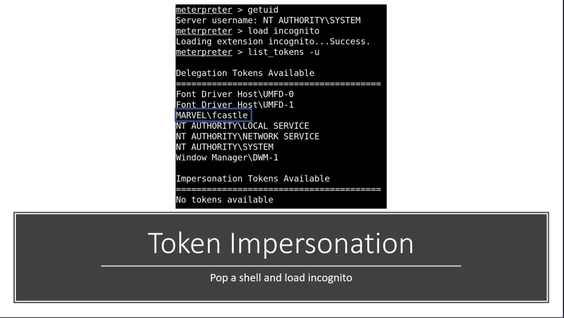
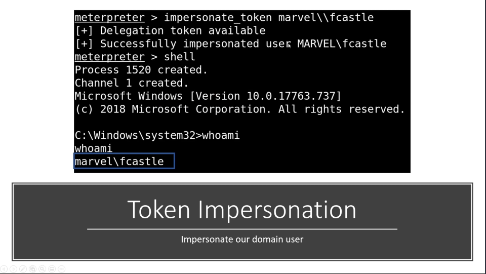
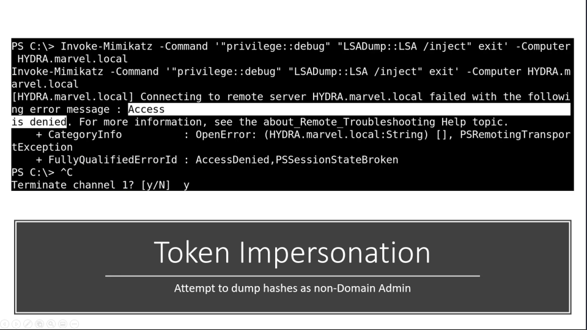
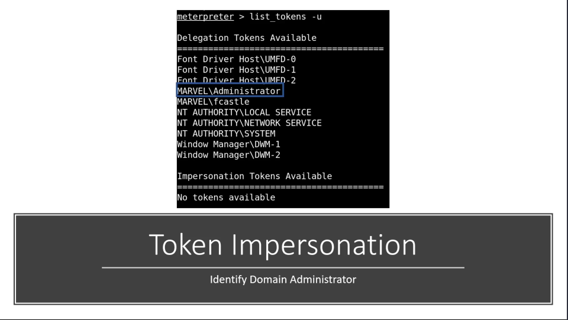
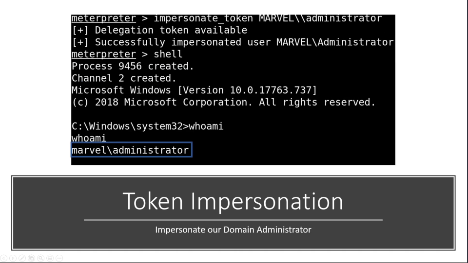
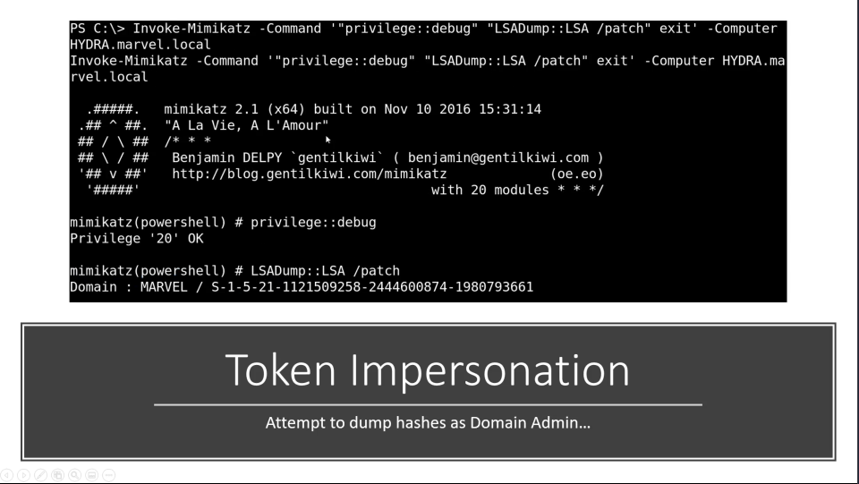
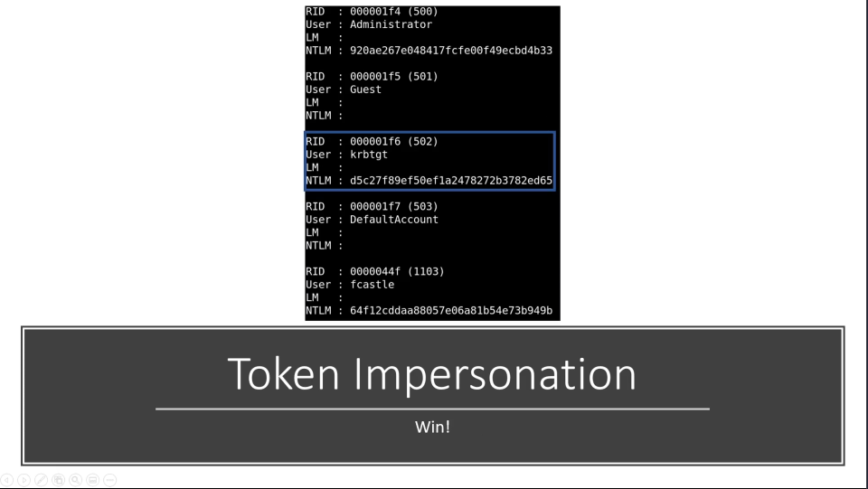
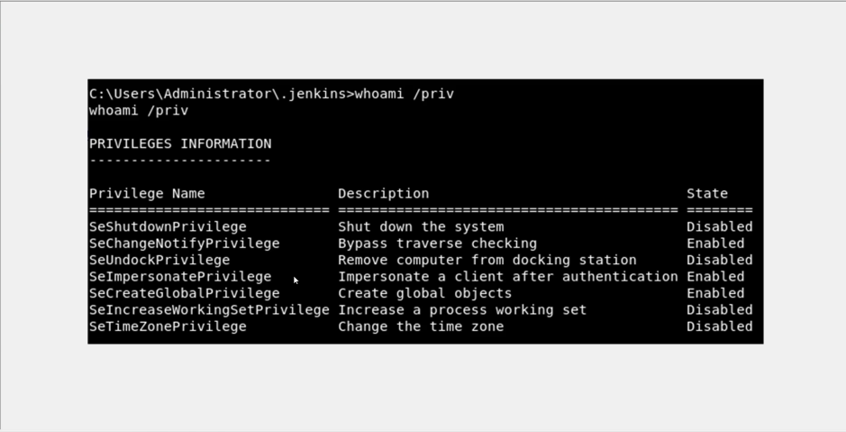
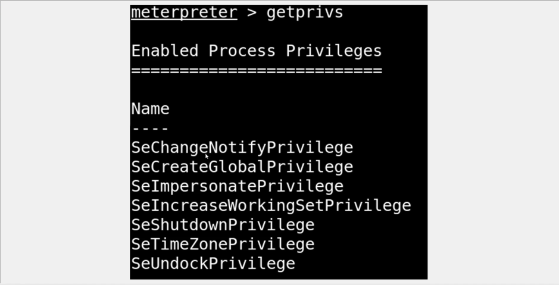

# Token Impersonation and Potato Attacks

## Token Impersonation 

Temporary keys that allow you access to a system/network without having to provide credentials each time you access a file. Think it as cookies for computers 

**Two Types:** 

- Delegate - Created for logging into a machine or using Remote Desktop 
- Impersonate - "non-interactive" such as attaching a network drive or a domain logon script 

**Alright, but what if a Domain Admin token was available?** 

To get to know about the impersonation privileges we can use 

here the ImpersonatePrivilege is enabled which could able to escalate to high privileged users 

Resources for [Impersonation Privileges](https://swisskyrepo.github.io/InternalAllTheThings/redteam/escalation/windows-privilege-escalation/#eop-impersonation-privileges)

if SeAssignPrimaryToken is enabled it could vulnerable to the potato attacks 
